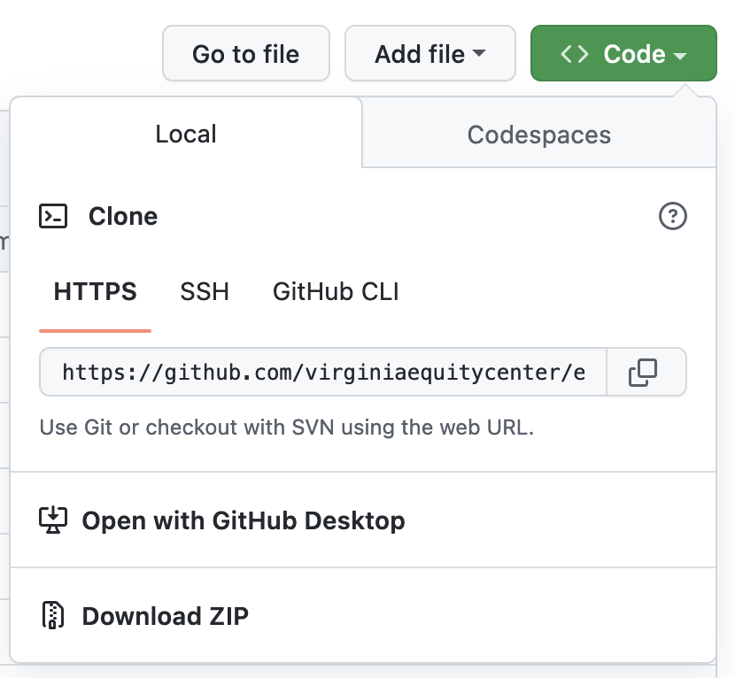
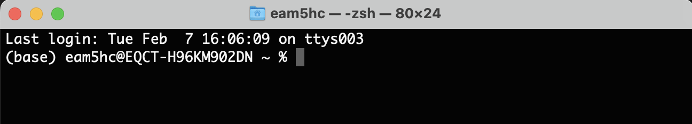
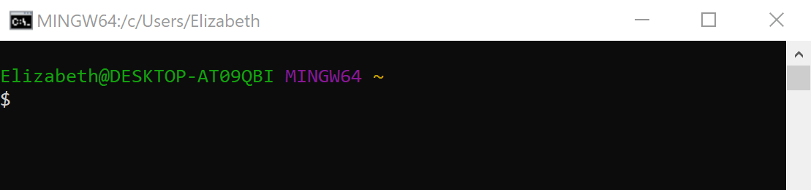
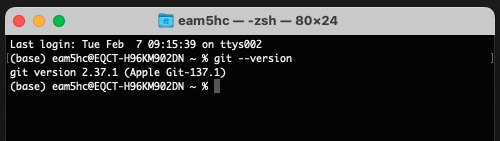
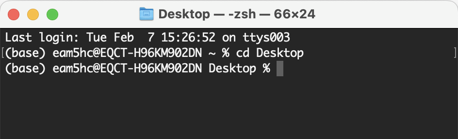
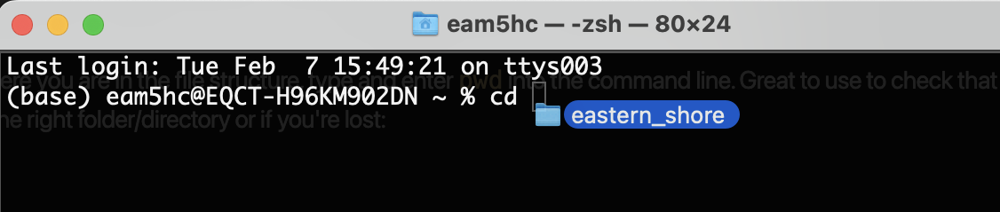
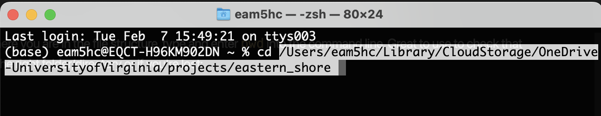
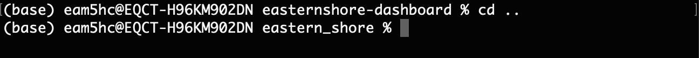
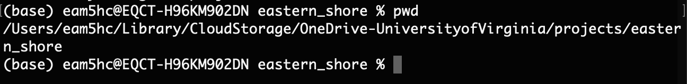
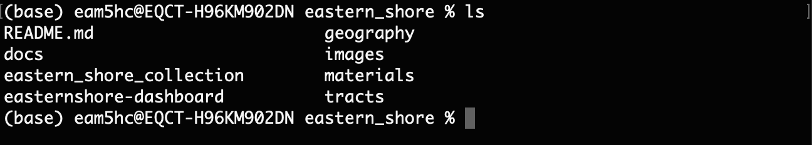

# Working with the Github Repo and Command Line

First time working with git and command line? [Follow these steps first.](#first-time-steps)

Forget your command line basics? [See reminders here.](#practice-with-command-line)

## Cloning the Remote Repo

1. Go to the Github Repository that you want to clone. Find and click on the green button towards the right side of the page that says **Code**:

    

2. Under **HTTPS** you'll see a url, click the copy button to the right to copy: 

    

3. In the command line, [change your working directory](#change-directory) to the location where you want to save this repository locally and use the `git clone` command. Type and enter:
    ```
    git clone <copied url>
    ```

    For the Eastern Shore Repo, it looks like this:
    ```
    git clone https://github.com/virginiaequitycenter/eastern_shore.git
    ```
4. Check your file system to see the files and begin working with your local repo. 

## Pull Changes from the Remote Repo

Now that you have a local version of the repo, you'll want to pull any changes that other users have made to the remote repository (Github). Use the command:
```
git pull origin
``` 
or 
```
git pull origin main
```

Origin is the name of the remote repository. Main is the name of the branch we are pulling from. Unless you've created a branch that is not tracking an upstream branch, you can just use `git pull` 

## Push Local Changes to the Remote Repo

After you've made changes to files in your local repo, push those changes to the remote on Github. This is the process I use:

1. Check the status of files in your local repo:
    ```
    git status
    ```
    This will generate a list of files that have been modified and/or added since you last pulled changes from the remote repo. Files listed in red are not yet staged for commit. Files listed in green are already staged for commit. Read through the list of files to identify which you want to push to Github.
2. Add files to the staging area:

    If you want to add all of the files listed in red above, use:
    ```
    git add -A
    ```
    If you want to add only select files, add each individually:
    ```
    git add your-file-name-here
    ```
    Example: 
    ```
    git add easternshore-dashboard/datacode/school_data.R
    ```
    If you made a mistake, you can remove it from the staging area:
    ```
    git reset 'your-file-name-here'
    ```
3. Check files staged for commit. I use this to double check that everything I want to add has been added to the staging area:
    ```
    git status
    ```
    (yes, its just `git status` again, use this as frequently as needed)
4. If everything you want to be green is green, we're ready to commit. Be sure to add a descriptive message about the commit (what you're adding, what you updated), like:
    ```
    git commit -m "updated app styling"
    ```
5. If you haven't pulled changes from the remote repo's main branch yet, now's the time to do it:
    ```
    git pull origin main
    ```
6. Now push changes to the remote repository:
    ```
    git push origin main
    ```
7. Check Github to see your changes. 

## First time steps

1. Create a Github account: https://github.com/

2. Find your preferred command line tool.
    - **For Mac users:** 
        - Git is usually installed by default (we'll check in Step 3)
        - Open the Terminal (can be found in the Utilities Folder in Applications)
            - Icon looks like this: 
            - Open application looks similar to this: 
            
                

    - **For Windows users:** 
        - Install Git:
            - Follow installation instructions here: https://www.youtube.com/watch?v=albr1o7Z1nw (watch first 2:45)
            - Links for Git download (in video above): https://git-scm.com/ or https://gitforwindows.org/
        - Open Git Bash
            - Icon looks like this: 
            - Open program looks similar to this:

                

3. Check your git version to makes sure it is installed. Open your command line tool (Terminal for Mac/ Git Bash for Windows) and type or copy/paste the following, then press enter:
    ```
    git --version
    ```
    You should see a response that says something like `git version 2.37.1` (version number is not important):

    

4. Set Config Values. Your user name and email will be the same as what you used to set up your Github account.

    Type and enter:
    ```
    git config --global user.name "Your User Name"
    ```
    Type and enter:
    ```
    git config --global user.email "Your Email"
    ```
    Check:
    ```
    git config --list
    ```
## Practice with command line

### Command Line Basics: Terminal (Mac) and Git Bash (Windows)

We’re going to do some very quick practice to get comfortable with the command line. All the commands will be the same for Terminal (Mac) and Git Bash (Windows), though the programs look slightly different. Let's take a closer look at each:

**Mac users:** Open the terminal (found in the Utilities folder in Applications):


- The shell or command prompt is the line where you type in commands, which are then passed on to the computer’s operating system to run. 
- Here, the shell prompt includes your user profile (`eam5hc@EQCT-H96KM902DN`), current directory (image taken from the home directory so it's just `~`) followed by `%`. Yours should look similar. 
- After entering a command, you can tell when the process is complete when it returns to the shell prompt (`%`). 

**Windows users:** Open Git Bash (Windows):


- Git Bash is an application that provides compatability for git in a Windows environment. The shell or command prompt is the line where you type in commands, which are then passed on to the computer’s operating system to run. 
- Here, the shell prompt includes your user profile (`Elizabeth@DESKTOP-AT09QBI`)<sup>*</sup>, current directory (image taken from the home directory so it's just `~`) followed by `$`. Yours should look similar. 
- After entering a command, you can tell when the process is complete when it returns to the shell prompt (`$`). 

    <sup>*</sup> `MINGW64` is 'Minimum GNU for Windows 64 bit.'  It's the name of a compiler used to build an extra copy of bash that "git for Windows" includes. Truly, don't worry about it.

### Navigating your file system 

The command line allows you to navigate your system in the same way you use Finder (Mac) or File Explorer (Windows) to find files and folders.

#### **Change Directory**

A directory is another word for a folder in your file system. In the same way that you need to open the correct folder to access a particular file, you need to navigate into the right directory using the command line.

Use the `cd` (change directory) command to navigate to a file or folder:
```
cd <directory name>
```
From the home directory, I can navigate to my Desktop with:
```
cd Desktop
```


You’ll notice that your shell prompt will update to include the name of your current directory/folder (`Desktop %`).


Notes: 
- Capitalization and spacing matters. Navigating onto your desktop requires ‘Desktop’ with a capital ‘D’.
- You can use the ‘tab’ key to autofill the rest of a directory or file name.

**If the path to your file is long and complicated (or you're not sure exactly where it lives in your system), you can drag and drop the folder into the command prompt after the `cd` and the path with autofill (just be sure to include a space after `cd`)**



**becomes:**



To navigate back, from the current directory into its parent directory, use the command `cd`, followed by a space and two periods:
```
cd ..
```



#### **Print Working Directory**

To see where you are in the file structure, type and enter `pwd` (print working directory) into the command line. It will print the path to your current directory:
```
pwd
```


#### **List Files and Folders**

To see the list of files and folders within your current directory, use the `ls` (list files) command:
```
ls
```



